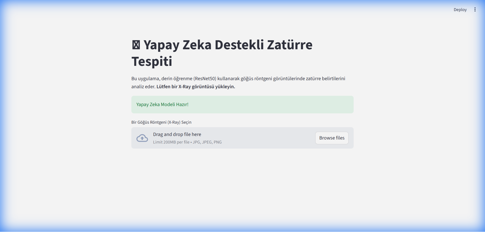
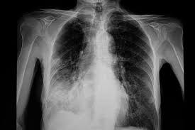
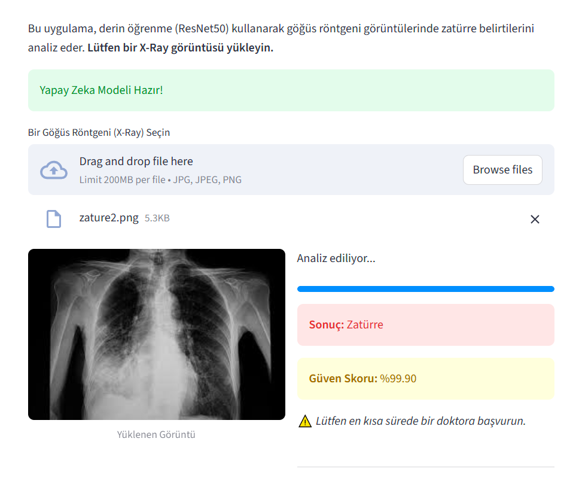
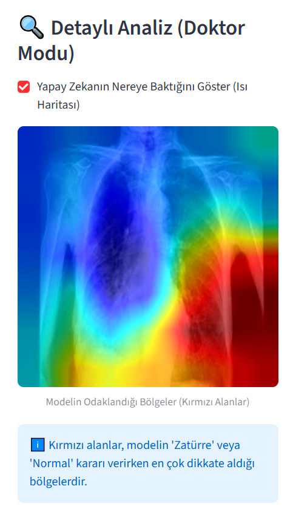

# 🫁 Yapay Zeka Destekli Zatürre (Pneumonia) Tespit Sistemi


## 📋 Proje Hakkında (Abstract)

Bu proje, Üretken Yapay Zeka ve Derin Öğrenme teknikleri kullanılarak, göğüs röntgeni (Chest X-Ray) görüntülerinden otomatik **Zatürre (Pneumonia)** tespiti yapabilen akıllı bir sistem geliştirmeyi amaçlamaktadır. Projenin temel hedefi, radyoloji uzmanlarına yardımcı olabilecek, yüksek doğruluk oranına sahip ve kararlarını açıklayabilen (XAI) bir klinik karar destek sistemi sunmaktır.

Sistem, **Transfer Learning (Aktarımlı Öğrenme)** yöntemiyle özelleştirilmiş **ResNet50** mimarisi üzerine kurgulanmış ve Docker konteynerizasyon teknolojisi ile dağıtılabilir hale getirilmiştir.

---

## 🏗️ Mimari ve Metodoloji

Projenin geliştirilmesinde aşağıdaki teknik altyapı ve yöntemler kullanılmıştır:

### 1. Derin Öğrenme Modeli: ResNet50
*   **Mimari:** Residual Neural Network (50 Katmanlı).
*   **Transfer Learning:** ImageNet veri seti üzerinde önceden eğitilmiş ağırlıklar (Weights) kullanılarak, modelin genel özellikleri (kenar, doku vs.) tanıması sağlanmış, ardından son katmanlar tıbbi görüntüler için yeniden eğitilmiştir (Fine-Tuning).
*   **Sınıflandırma:** Son "Fully Connected" katman, ikili sınıflandırma (Normal vs. Pneumonia) yapacak şekilde modifiye edilmiştir.

### 2. Açıklanabilir Yapay Zeka (XAI)
Modelin "Kara Kutu" (Black Box) olmasını engellemek için **Grad-CAM (Gradient-weighted Class Activation Mapping)** algoritması entegre edilmiştir.
*   **İşlevi:** Modelin karar verirken röntgen görüntüsünde hangi bölgelere odaklandığını "Isı Haritası" (Heatmap) olarak görselleştirir.
*   **Önemi:** Doktorların, yapay zekanın "Zatürre" kararını akciğerin hangi lokasyonuna bakarak verdiğini teyit etmesini sağlar.

---

## 📊 Eğitim Süreci ve Sonuçlar

Model eğitim süreci, **Google Colab (T4 GPU)** ortamında gerçekleştirilmiştir. Eğitim sürecine ait detaylar `Zaturre_Egitim_Sonuclari.ipynb` dosyasında mevcuttur.

*   **Veri Seti:** Kaggle Chest X-Ray Images (Pneumonia)
    *   Eğitim Verisi: 5,216 Görüntü
    *   Test Verisi: 624 Görüntü
*   **Hiperparametreler:**
    *   Optimizer: Adam
    *   Batch Size: 32
    *   Learning Rate: 0.001
    *   Epoch: 3

### 📈 Performans Metrikleri

Eğitim sürecinde elde edilen Epoch bazlı başarı oranları aşağıdaki gibidir:

| Epoch | Kayıp (Loss) | Doğruluk (Accuracy) |
| :---: | :---: | :---: |
| 1 | 0.1943 | **%93.23** |
| 2 | 0.1262 | **%95.44** |
| 3 | 0.1007 | **%96.41** |

> **Analiz:** Model sadece 3 Epoch sonunda %96.41 gibi yüksek bir doğruluk oranına ulaşmıştır. Loss değerindeki istikrarlı düşüş, modelin veriyi başarılı bir şekilde öğrendiğini (Overfitting olmadan) kanıtlamaktadır.

---

## 🚀 Kurulum ve Kullanım

Proje tamamen Dockerize edilmiştir, bu sayede tek bir komutla herhangi bir ortamda çalıştırılabilir.

### A. Docker ile Çalıştırma (Önerilen)

Terminal veya PowerShell üzerinden aşağıdaki komutları uygulayınız:

1.  **İmajı İndirin:**
    ```bash
    docker pull mutlutuver/zaturre-tespiti:latest
    ```

2.  **Uygulamayı Başlatın:**
    ```bash
    docker run -p 8501:8501 mutlutuver/zaturre-tespiti:latest
    ```

3.  **Erişim:** Tarayıcınızda `http://localhost:8501` adresine gidin.

### B. Uygulama Özellikleri

1.  **Resim Yükleme:** `.jpg` veya `.png` formatındaki röntgen görüntsünü sisteme yükleyin.
2.  **Otomatik Teşhis:** Sistem anlık olarak "Normal" veya "Zatürre" sonucunu Güven Skoru ile birlikte verir.
3.  **Doktor Modu (XAI):** Sonuç ekranında **"Isı Haritasını Göster"** kutucuğunu işaretleyerek modelin odaklandığı patolojik bölgeleri inceleyebilirsiniz.


### 📸 Uygulama Ekran Görüntüleri ve Kullanım Adımları

**1. Başlangıç Ekranı**
Uygulama ilk açıldığında kullanıcıyı karşılayan modern ve sade arayüz. Kullanıcı buradan analiz sürecini başlatır.


**2. Örnek Veri (Girdi)**
Analiz edilmek üzere sisteme yüklenecek olan Zaire (Pnömoni) şüphesi taşıyan akciğer röntgen görüntüsü.


**3. Teşhis ve Güven Skoru**
Görsel sisteme yüklendikten hemen sonra yapay zeka modelinin tahmin sonucu (Zatürre/Normal) ve %90'ın üzerindeki güven skoru ekrana yansır.


**4. Açıklanabilir Yapay Zeka (XAI - Isı Haritası)**
Doktor Modu aktif edildiğinde, Grad-CAM algoritması devreye girer ve modelin "Zatürre" kararı verirken akciğerin hangi bölgesine odaklandığını kırmızı/sıcak renklerle gösterir.


---

## 📁 Proje Yapısı

```
.
├── Dockerfile              # Konteyner konfigürasyonu
├── gereksinimler.txt       # Python kütüphane bağımlılıkları
├── uygulama/
│   ├── ana_uygulama.py     # Streamlit arayüz kodları
│   ├── model_islemleri.py  # Model yükleme, tahmin ve Grad-CAM fonksiyonları
│   └── zaturre_modeli.pth  # Eğitilen model dosyası (Weights)
├── Zaturre_Egitim_Sonuclari.ipynb  # Eğitim kodları ve grafik sonuçları
└── README.md               # Proje dokümantasyonu
```

---

## 👥 İletişim

**Geliştirici:** Nurettin Mutlu Tüver/ 251137142
**Ders:** Üretken Yapay Zeka (Midterm Assignment)
